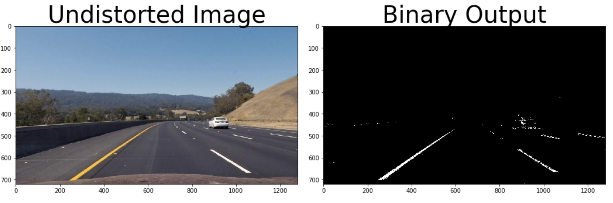

## Advanced Lane Finding

In this project, our goal is to write a software pipeline to identify the lane boundaries in a video.

The Project
---

The goals / steps of this project are the following:

* Compute the camera calibration matrix and distortion coefficients given a set of chessboard images.

    

* Apply a distortion correction to raw images.

  

  
  

* Use color transforms, gradients, etc., to create a thresholded binary image.

  

      
  

* Apply a perspective transform to rectify binary image ("birds-eye view").

  

      
  

* Detect lane pixels and fit to find the lane boundary.

  

      
  

* Determine the curvature of the lane and vehicle position with respect to center.

  

      
  

* Warp the detected lane boundaries back onto the original image.

  

      
  

* Output visual display of the lane boundaries and numerical estimation of lane curvature and vehicle position.

<iframe name="music" src="output_videos/project_video.mp4" marginwidth="1px" marginheight="20px" width=20% height="500px" frameborder=1 　scrolling="yes">
</iframe>

To help the reviewer examine your work, please save examples of the output from each stage of your pipeline in the folder called `output_images`, and include a description in your writeup for the project of what each image shows.    The video called `project_video.mp4` is the video your pipeline should work well on.  

The `challenge_video.mp4` video is an extra (and optional) challenge for you if you want to test your pipeline under somewhat trickier conditions.  The `harder_challenge.mp4` video is another optional challenge and is brutal!

If you're feeling ambitious (again, totally optional though), don't stop there!  We encourage you to go out and take video of your own, calibrate your camera and show us how you would implement this project from scratch!

