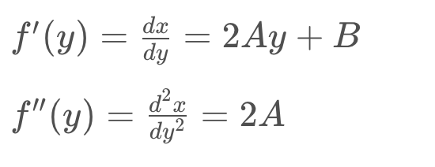

## Advanced Lane Finding

In this project, our goal is to write a software pipeline to identify the lane boundaries in a video.

The Project
---

The goals / steps of this project are the following:

* Compute the camera calibration matrix and distortion coefficients given a set of chessboard images.

    

* Apply a distortion correction to raw images.

  

  
  

* Use color transforms, gradients, etc., to create a thresholded binary image.

  

      
  

* Apply a perspective transform to rectify binary image ("birds-eye view").

  

      
  

* Detect lane pixels and fit to find the lane boundary.

  

      
  

* Determine the curvature of the lane and vehicle position with respect to center.

  

      
  

* Warp the detected lane boundaries back onto the original image.

  

      
  

* Output visual display of the lane boundaries and numerical estimation of lane curvature and vehicle position.

  The final output video could be watched in the path "output_videos/project_video.mp4". (if below code doesnt work well)

  <iframe
          width="800"
          height="450"
          src="output_videos/project_video.mp4"
          frameborder="0"
          allowfullscreen>
  </iframe>

